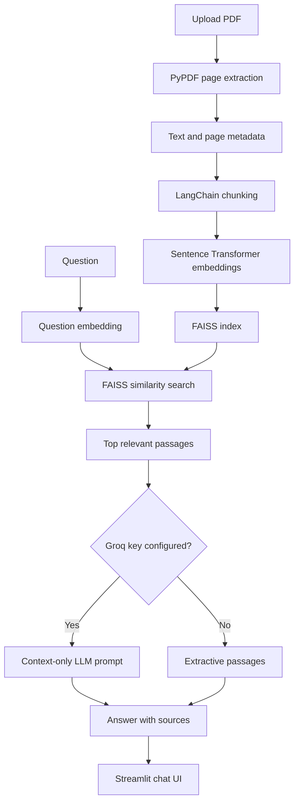

# Architecture

```mermaid
flowchart TD
 A[Upload PDF] --> B[PyPDF page extraction]
 B --> C[Text and page metadata]
 C --> D[LangChain chunking]
 D --> E[Sentence Transformer embeddings]
 E --> F[FAISS index]
 G[Question] --> H[Question embedding]
 H --> I[FAISS similarity search]
 F --> I
 I --> J[Top relevant passages]
 J --> K{Groq key configured?}
 K -->|Yes| L[Context-only LLM prompt]
 K -->|No| M[Extractive passages]
 L --> N[Answer with sources]
 M --> N
 N --> O[Streamlit chat UI]
```
